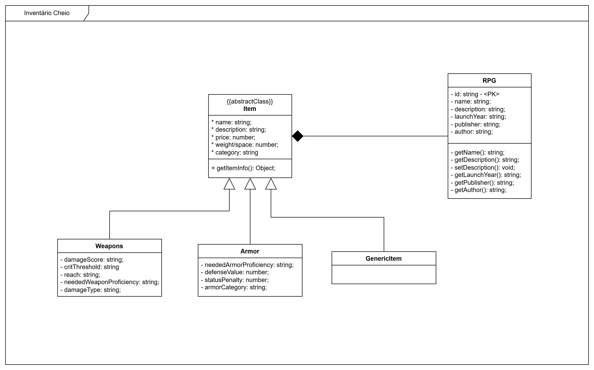

# Inventário Cheio

## Sumário

1. Descrição
2. Tecnologias
3. Documentação
  3.1 Recursos da Api
  3.2 Rotas Públicas
  3.3 Rotas de Administrador
  3.4 Swagger
4. Licença
5. Autor

## Descrição

"Inventário Cheio"  é um simples sistema de gerenciamento de items para Sistemas de RPG de mesa. O objetivo do sistema é gerar uma enciclopédia de recursos de RPG, para diferentes comunidades serem capazes de usarem da forma que precisam.

## Tecnologias

1. NestJs
2. Postgresql
3. Redis
4. Jest
5. Docker e Docker Compose

## Documentação

### Recursos da Api

Recorte da interação entre as entidades de domínio do sistema:
RPG - Roleplaying Game
Item - Componente do sistema
Weapon - Tipo de item
Armor - Tipo de item

#### Rotas Públicas

Rotas públicas, usadas para buscar informações acerca dos itens de um RPG

| Method | Route                  |
| ------ | ---------------------- |
| GET    | /api/rpg               |
| GET    | /api/rpg/:id           |
| GET    | /api/rpg/:id/items     |
| GET    | /api/rpg/:id/items/:id |

#### Rotas de Administrador

Rotas usadas para modificar e resgatar informações diretamente dos itens registradas na aplicação. Para utilizar essa rota, você precisa de um Bearer Token com permissões corretas.

| Method | Route          |
| ------ | -------------- |
| GET    | /api/items     |
| POST   | /api/items     |
| GET    | /api/items/:id |
| PATCH  | /api/items/:id |
| DELETE | /api/items/:id |

#### Swagger

Rotas e recursos do sistema também acessíveis via Swagger
(WIP)

## Licença

Esse projeto está sobre a licença do MIT

## Autor

Projeto desenvolvido e mantido por:
[Immanuel Victor](https://github.com/Immanuel-Victor)
